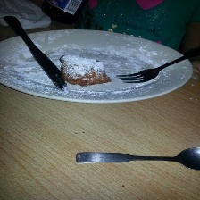
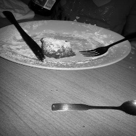
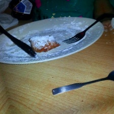
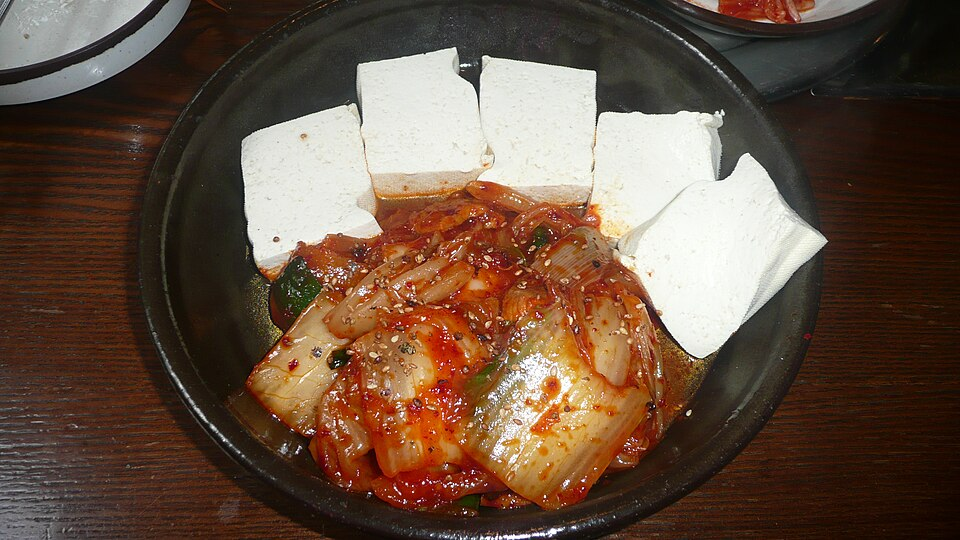
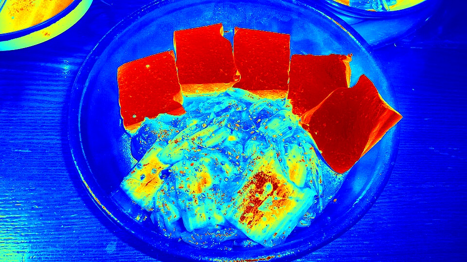
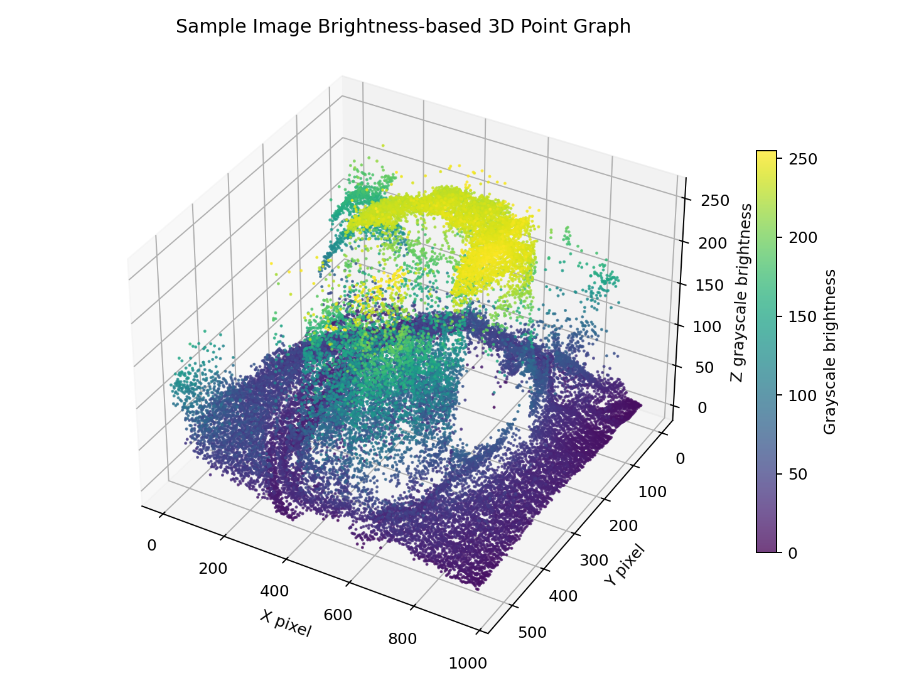
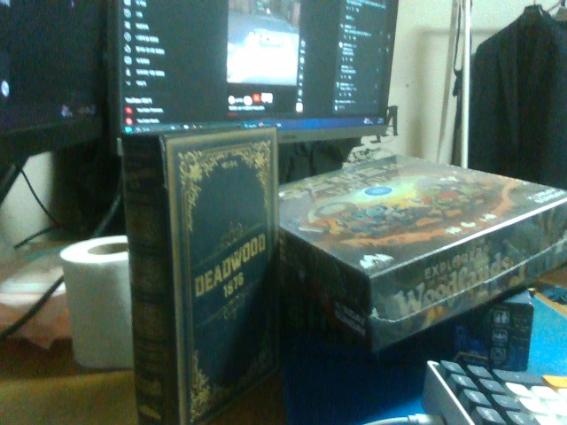
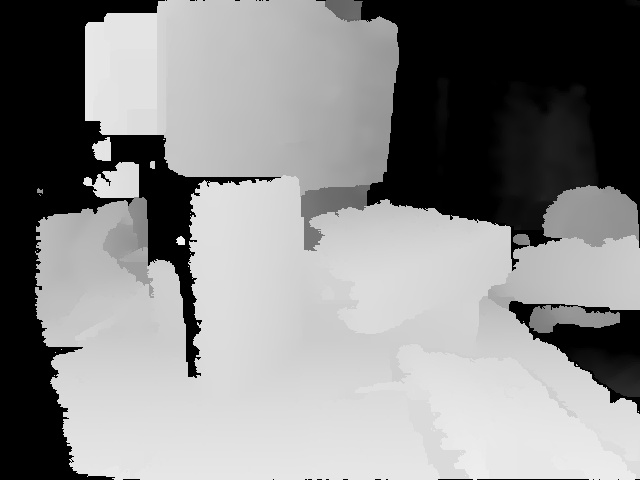
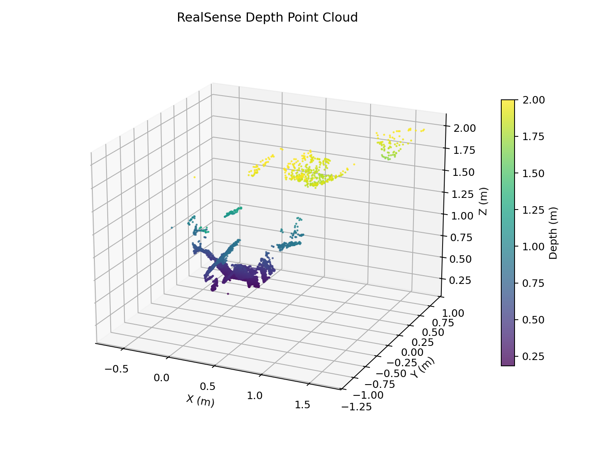
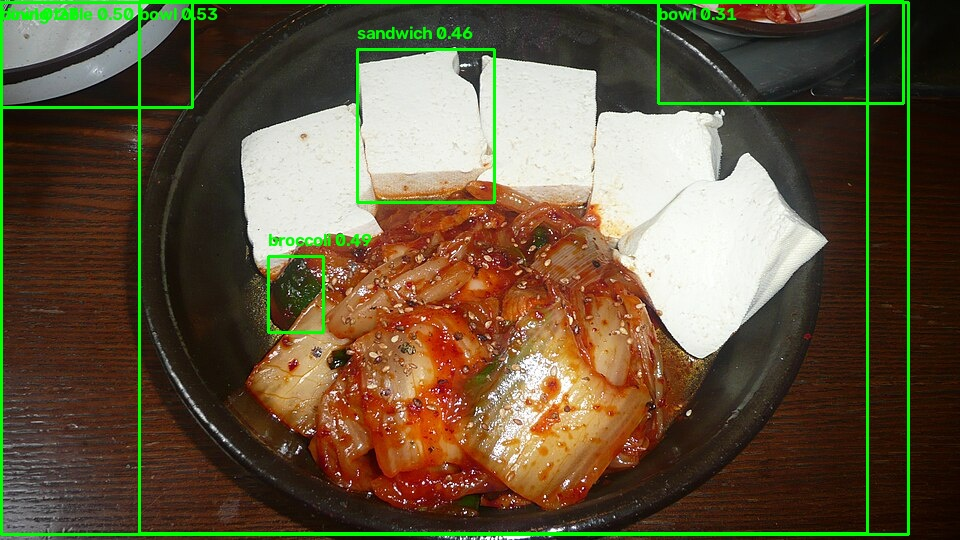

# 스마트 냉장고 식품 이미지 처리 및 2D-3D 변환 프로젝트

## 프로젝트 개요

스마트 냉장고 카메라로 촬영한 식품 이미지를 처리하는 Computer Vision 실습 프로젝트입니다. 1주차에는 이미지 전처리와 색상 영역 검출을 수행했고, 2주차에는 Unit Test와 Grayscale 기반 가상 Depth Map, 3D 좌표 배열 변환을 구현했습니다. 이후 RealSense D435 카메라를 이용한 실제 depth frame 캡처와 3주차 YOLOv8 객체 탐지 학습 실습을 추가했습니다.

현재 Depth Map 결과는 두 종류입니다.

- `src/depth_processing.py`: 실제 거리 센서나 딥러닝 모델이 추정한 깊이가 아니라 Grayscale 밝기값을 깊이처럼 사용한 실습용 가상 Depth Map입니다.
- `src/realsense_depth_processing.py`: RealSense D435의 depth stream에서 얻은 meter 단위 depth frame을 이용한 실제 Depth Map입니다.

## 주요 기능

### 1주차 이미지 전처리

구현 파일:

- `src/basic_processing.py`
- `src/huggingface_loader.py`
- `src/preprocessing.py`
- `src/image_preprocessing.py`

주요 처리 내용:

- `data/sample.png`를 OpenCV로 읽고 HSV 색상 공간에서 빨간색 영역을 감지합니다.
- 빨간색 HSV 범위를 두 구간으로 나누어 mask를 만들고 `cv2.bitwise_and`로 빨간색 영역만 필터링합니다.
- Hugging Face `ethz/food101` 데이터셋을 streaming 방식으로 로드합니다.
- Food-101 이미지를 `224x224` 크기로 조정합니다.
- 평균 밝기가 너무 낮은 이미지와 객체 영역이 너무 작은 이미지를 제외합니다.
- Grayscale 변환과 `cv2.normalize`를 이용한 밝기 정규화를 수행합니다.
- Gaussian Blur, 좌우 반전, 15도 회전, HSV 기반 색상 변화를 적용합니다.
- 전처리 결과 이미지를 `outputs/preprocessing/`에 저장합니다.

### 2주차 Grayscale 기반 가상 Depth Map

구현 파일:

- `src/depth_processing.py`
- `tests/test_depth_processing.py`

주요 처리 내용:

- 입력 이미지를 Grayscale로 변환합니다.
- `cv2.applyColorMap(gray, cv2.COLORMAP_JET)`으로 Depth Map처럼 보이는 컬러 이미지를 생성합니다.
- 각 픽셀의 X, Y 좌표와 Grayscale 밝기값을 Z값으로 사용해 `(height, width, 3)` 형태의 3D 좌표 배열을 생성합니다.
- `None` 입력에 대해 `ValueError`를 발생시킵니다.
- `pytest`로 Depth Map 반환 자료형, 출력 크기, 예외 처리, 3D 배열 크기를 검증합니다.

이 Depth Map은 실제 물체까지의 거리를 나타내지 않습니다. Grayscale 밝기값을 깊이값처럼 사용한 기초 실습용 변환입니다.

### RealSense 실제 Depth Map

구현 파일:

- `src/realsense_depth_processing.py`

주요 처리 내용:

- `pyrealsense2`로 RealSense D435의 depth stream과 color stream을 읽습니다.
- depth frame의 `z16` 값을 depth scale로 변환해 meter 단위 depth 배열을 생성합니다.
- 유효 거리 범위를 `0.1m` 초과, `2.0m` 이하로 제한합니다.
- 가까운 지점이 더 밝게 보이도록 Grayscale Depth Map을 생성합니다.
- `cv2.applyColorMap`으로 컬러 Depth Map을 저장합니다.
- depth intrinsics와 meter 단위 depth 값을 이용해 실제 3D 좌표 point cloud를 계산합니다.
- `outputs/realsense_depth/`에 RGB 이미지, Grayscale Depth Map, 컬러 Depth Map, point cloud 그래프, depth 배열 `.npy` 파일을 저장합니다.

### 3주차 YOLOv8 학습 및 객체 탐지

구현 파일:

- `datasets/week3_yolo_sample/data.yaml`
- `src/train_yolo.py`
- `src/object_detection.py`

주요 처리 내용:

- `src/train_yolo.py`는 Ultralytics COCO8 예제 데이터셋을 `datasets/week3_yolo_sample/coco8/`에 다운로드합니다.
- `datasets/week3_yolo_sample/data.yaml`은 COCO 클래스 이름과 학습/검증 이미지 경로를 정의합니다.
- 실행 시 로컬 절대 경로를 반영한 `datasets/week3_yolo_sample/data_runtime.yaml`을 생성해 학습에 사용합니다.
- `yolov8n.pt`를 시작 모델로 사용하고, 기본 설정은 CPU 학습, `epochs=10`, `imgsz=640`입니다.
- 학습된 가중치는 `runs/detect/week3_yolo_train/weights/best.pt`에 생성됩니다.
- `src/object_detection.py`는 기본적으로 학습된 `best.pt`를 사용해 `data/sample.jpg`를 추론합니다.
- 탐지 결과 이미지는 `outputs/object_detection/sample_detected.jpg`, 탐지 결과 JSON은 `outputs/object_detection/detection_results.json`에 저장합니다.

COCO8은 매우 작은 예제 데이터셋입니다. 현재 구현은 YOLO 학습과 추론 흐름을 실습하기 위한 것이며, 스마트 냉장고 식품 전용 모델이라고 볼 수는 없습니다.

## 프로젝트 구조

```text
.
├── .gitignore
├── README.md
├── data/
│   ├── sample.jpg
│   └── sample.png
├── datasets/
│   └── week3_yolo_sample/
│       └── data.yaml
├── outputs/
│   ├── object_detection/
│   │   ├── detection_results.json
│   │   └── sample_detected.jpg
│   ├── preprocessing/
│   │   ├── 01_resized.jpg
│   │   ├── 02_gray_normalized.jpg
│   │   ├── 03_blurred.jpg
│   │   ├── 04_flipped.jpg
│   │   └── 05_rotated_color.jpg
│   ├── realsense_depth/
│   │   ├── realsense_color.jpg
│   │   ├── realsense_depth_colormap.jpg
│   │   ├── realsense_depth_gray.jpg
│   │   ├── realsense_depth_m.npy
│   │   └── realsense_point_cloud.png
│   └── virtual_depth/
│       ├── depth_map.jpg
│       └── sample_point_cloud.png
├── src/
│   ├── __init__.py
│   ├── basic_processing.py
│   ├── depth_processing.py
│   ├── huggingface_loader.py
│   ├── image_preprocessing.py
│   ├── object_detection.py
│   ├── preprocessing.py
│   ├── realsense_depth_processing.py
│   └── train_yolo.py
└── tests/
    └── test_depth_processing.py
```

`runs/`, `*.pt`, `datasets/week3_yolo_sample/coco8/`, `datasets/week3_yolo_sample/data_runtime.yaml`은 실행 중 생성되는 학습 산출물이므로 `.gitignore` 대상입니다.

## 개발 환경

- Python 3
- OpenCV
- NumPy
- Hugging Face datasets
- Pillow
- pytest
- matplotlib
- pyrealsense2
- ultralytics
- PyTorch

현재 저장소에는 `requirements.txt`가 없습니다.

## 설치 방법

Windows Git Bash 기준 설치 흐름입니다.

```bash
python -m venv .venv
source .venv/Scripts/activate
python -m pip install opencv-python numpy datasets pillow pytest matplotlib pyrealsense2 ultralytics
```

현재 로컬 환경에서는 RTX 3060 Ti가 장치로 확인되지만, 설치된 PyTorch는 CPU 빌드입니다. 따라서 YOLO 학습 스크립트의 기본 설정은 `device="cpu"`입니다.

## 실행 방법

### 1주차 이미지 전처리 실행

```bash
python src/image_preprocessing.py
```

`data/sample.png`의 빨간색 영역 필터링 결과를 OpenCV 창으로 표시하고, Food-101 데이터셋에서 선택한 이미지를 전처리해 `outputs/preprocessing/`에 저장합니다.

### 2주차 가상 Depth Map 실행

```bash
python src/depth_processing.py
```

`data/sample.jpg`를 읽어 Grayscale 밝기 기반 Depth Map을 만들고 `outputs/virtual_depth/depth_map.jpg`로 저장합니다. 실행 중 OpenCV 창으로 원본 이미지와 Depth Map을 표시합니다.

### RealSense 실제 Depth Map 실행

```bash
python src/realsense_depth_processing.py
```

RealSense D435에서 depth frame과 color frame을 캡처하고 `outputs/realsense_depth/`에 결과를 저장합니다.

생성 결과:

- `outputs/realsense_depth/realsense_color.jpg`
- `outputs/realsense_depth/realsense_depth_gray.jpg`
- `outputs/realsense_depth/realsense_depth_colormap.jpg`
- `outputs/realsense_depth/realsense_point_cloud.png`
- `outputs/realsense_depth/realsense_depth_m.npy`

### 3주차 YOLOv8 학습 실행

```bash
python src/train_yolo.py --epochs 10
```

COCO8 예제 데이터셋을 다운로드하고 YOLOv8n 모델을 10 epoch 학습합니다. 학습 결과는 `runs/detect/week3_yolo_train/weights/best.pt`에 생성됩니다. 이 파일은 학습 산출물이므로 커밋 대상에서 제외합니다.

### 3주차 객체 탐지 실행

```bash
python src/object_detection.py
```

학습된 `runs/detect/week3_yolo_train/weights/best.pt`를 사용해 `data/sample.jpg`를 추론합니다.

생성 결과:

- `outputs/object_detection/sample_detected.jpg`
- `outputs/object_detection/detection_results.json`

### 테스트 실행

```bash
pytest tests/test_depth_processing.py -v
```

`src/depth_processing.py`의 Depth Map 생성 함수와 3D 좌표 배열 생성 함수를 검증합니다.

## Unit Test

테스트 파일은 `tests/test_depth_processing.py`입니다.

- `test_generate_depth_map`
  - `100x100x3` NumPy 이미지를 입력합니다.
  - 반환값이 `np.ndarray`인지 확인합니다.
  - 반환 이미지 크기가 입력 이미지와 같은지 확인합니다.
- `test_generate_depth_map_none`
  - `generate_depth_map(None)` 호출 시 `ValueError`가 발생하는지 확인합니다.
- `test_generate_point_cloud`
  - `100x100x3` NumPy 이미지를 입력합니다.
  - 반환값이 `np.ndarray`인지 확인합니다.
  - 반환 배열 크기가 `(100, 100, 3)`인지 확인합니다.

현재 확인된 테스트 결과:

- `test_generate_depth_map`: PASSED
- `test_generate_depth_map_none`: PASSED
- `test_generate_point_cloud`: PASSED
- 총 3개 테스트 통과

## 시각적 결과

### 1주차 전처리 결과







### 2주차 Before & After





### 2주차 Grayscale 기반 3D 점 그래프



### RealSense 실제 Depth 결과







### 3주차 YOLOv8 객체 탐지 결과



## 구현상의 한계

- `src/depth_processing.py`의 Depth Map은 실제 깊이 추정 결과가 아니라 밝기 기반 시각화입니다.
- 실제 깊이 추정을 위해서는 스테레오 카메라, Depth Sensor 또는 단안 깊이 추정 모델이 필요합니다.
- 가상 포인트 클라우드는 X, Y, 밝기 기반 Z값으로 구성된 기초 실습 형태입니다.
- RealSense 결과는 촬영 환경, 물체 재질, 반사, 거리, 카메라 각도에 영향을 받습니다.
- YOLOv8 학습은 COCO8 예제 데이터셋 기반입니다. 데이터 수가 적고 식품 전용 데이터셋이 아니므로 실제 냉장고 식품 인식 성능을 대표하지 않습니다.

## 향후 개선 방향

- 실제 Depth Estimation 모델 적용
- Open3D를 이용한 포인트 클라우드 시각화
- 다양한 식품 이미지에 대한 테스트 확장
- 식품 전용 이미지/라벨 데이터셋 구축
- YOLO 학습 데이터 확대 및 테스트 케이스 보강
